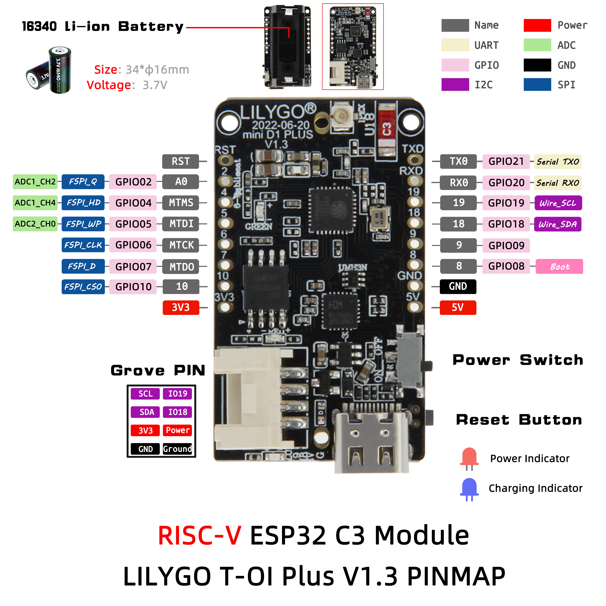

<h1 align = "center">🌟LILYGO T-OI-PLUS🌟</h1>

## **English | [中文](./README_CN.MD)**

<h3 align = "left">New version:</h3> 
**The new version has fixed the glitch that caused crystal burrs to start wifi and ble reset**

<h3 align = "left">Quick start:</h3>

**USE Arduino IDE**

1. Install the current upstream Arduino IDE at the 1.8 level or later. The current version is at the [Arduino website](http://www.arduino.cc/en/main/software).
2. Start Arduino and open Preferences window. In additional board manager add url: https://raw.githubusercontent.com/espressif/arduino-esp32/gh-pages/package_esp32_index.json .separating them with commas.
3. Select Tools -> Board -> ESP32C3 Dev Module
4. If you do not have a driver installed, you need to install it (Window:ch341ser2.exe, MAC:ch34x_mac_driver_v1.6.zip [New driver reference](https://github.com/LilyGO/LILYGO-T-OI/issues/3#issuecomment-907645945 ))
5. Need to install the following dependencies
     - [Adafruit_NeoPixel](https://github.com/adafruit/Adafruit_NeoPixel)

**USE Micropython**

1. [Download and upload the firmware](https://micropython.org/download/esp32c3/)
2. Note that the firmware upload address is 0x0, not 0x1000.

<h3 align = "left">Product 📷:</h3>

|  Product  |                            Product  Link                            |
| :-------: | :-----------------------------------------------------------------: |
| T-OI-PLUS | [AliExpress](https://www.aliexpress.com/item/1005003348936965.html) |

## Pinout

